# Capstone Project: Cyclistic Bike Share Case Study 
By Lillian Kaiser - October 2023

## Case Background:

In this case study, the business task is to analyze historical bike trip data of Cyclistic, a bike-share company in Chicago, to understand how casual riders and Members use Cyclistic bikes differently. Cyclistic operates a successful bike-share business with 5,824 bicycles and 692 stations in Chicago. The company offers two Rider Types:

-	**Casual Riders:** These are customers who purchase single-ride or full-day passes, indicating they use the service infrequently or on a pay-as-you-go basis. 
-	**Member:** These are subscribers who pay an annual fee, providing them with unlimited access to the bikes throughout the year. 

The primary objective is to gain insights from the data that will help the marketing team develop a new strategy to convert casual riders into annual riders. To do this, the analysis will likely involve examining various aspects of bike usage by both types of customers, including ride frequency, trip duration, and popular riding days. The findings can be used to tailor marketing strategies that encourage casual riders to become members and thereby increase the company's recurring revenue.

### About the Company:

Cyclistic launched its bike-share program in 2016, which has since grown to include 5,824 GPS-tracked bikes across 692 stations in Chicago. Riders can pick up a bike from one station and return it to any other within the network, offering flexibility and convenience.

Cyclistic's marketing strategy has traditionally focused on raising awareness and attracting a broad customer base with flexible pricing options, including single-ride passes, full-day passes, and annual memberships. Casual riders purchase single-ride or full-day passes, while annual memberships offer more value and consistency.

Financial analysis shows that members are more profitable than casual riders. With future growth in mind, marketing lead Moreno believes the key is converting casual riders into annual riders. Casual riders are already familiar with Cyclistic and use it for their mobility needs, making them a prime target for membership.

Moreno’s goal is to develop marketing strategies focused on this conversion. To support this, the marketing team is working to understand the differences between casual riders and Annual riders, explore what would motivate casual riders to switch, and assess how digital media can enhance these efforts. They’ll be analyzing historical bike trip data to uncover trends that can guide their approach.

### Google Data Analysis Process:

The Google Data Analytics Professional Certificate uses a methodology for data analysis which involves 6 phrases:  ASK, PREPARE, PROCESS, ANALYSE, SHARE AND ACT

## Ask – Understanding the project and problem that needs solving  
Business Task: Define the Problem: 
The challenge at hand is to create a data-driven marketing campaign that will effectively convert casual riders of Cyclistic, a bike-share company in Chicago, into annual riders. The future success of Cyclistic heavily relies on maximizing the number of annual riderships. The director of marketing, Lily Moreno, envisions a comprehensive strategy that not only attracts new customers but also capitalizes on the existing awareness of the Cyclistic program among casual riders. 
The business goal is to understand the behavioral differences between casual riders and annual riders, in order to develop data-driven strategies that encourage casual riders to become annual riders.

#### Stakeholders:
-	**Lily Moreno:** Director of Marketing  
-	**Cyclistic executive team:** The notoriously detail-oriented executive team will decide whether to approve the recommended marketing program. 
-	**Cyclistic Marketing Analytics Team:** who are responsible for collecting, analyzing, and reporting data that helps guide Cyclistic marketing strategy.  

#### Deliverables for the project:
  1.  A clear statement of the business task
  2.	A description of all data sources used
  3.	Documentation of any cleaning or manipulation of data
  4.	A summary of the analysis
  5.	Supporting visualizations and key findings
  6.  Top three recommendations based on the analysis

#### Three questions that will guide the marketing project:
  1.	How do annual riders and casual riders use Cyclistic bikes differently?
  2.	Why would casual riders buy Cyclistic memberships? 
  3.	How can Cyclistic use digital media to influence casual riders to become annual riders?

 

## Prepare – Extract and prepare the data for analysis  

### Data Acquisition and Verification:
-	Data Source: Obtain Cyclistic historical bike trip data from the official source: Cyclistic Historical Data.  
-	Data License: Ensure data availability under the license agreement provided by Motivate International Inc.: Data License Agreement. 
-	Public Accessibility: Verify that the data is publicly accessible.

### Data Integrity Verification:
•	Data Duration: Utilize a 12-month dataset spanning from August 2022 to July 2023 to identify trends. 
•	ROCCC Analysis:<pre> 
   •	Reliable: Confirm that the dataset is unbiased and reliable.
   •	Original: Ensure that the dataset used in the analysis is original and publicly accessible.
   •	Comprehensive: Check that the dataset is comprehensive and free from significant missing or incomplete information.
   •	Current: Verify that the data is up to date and updated on a monthly basis.
   •	Citation: Confirm that the dataset is appropriately cited.</pre>
   
### Data Extraction and Organization:

  - Data Download: Download 12 CSV files, each covering a specific month from August 2022 to July 2023. Store these files on your computer for analysis. 
  - Data Variables: Identify that each CSV file contains the same 9 variables, including Distinct Ride ID, bike types, station information (ride_id, rideable_type, started_at, ended_at, start_station_name, end_station_name, membership ride_length, Weekday)   
  -	Data Organization: Organize the data by grouping it by month and year to facilitate analysis. 
  -	Data Filtering and Sorting: Filter and sort the data to identify patterns and relationships related to ride frequency and ride duration, which are essential for understanding membership adoption. 

### Insight Identification:
  -	Consider explaining common factors among members, such as ride frequency and ride duration, to better understand how these behaviors relate to membership adoption. 
  - Plan to present insights that suggest correlations between usage patterns and annual ridership purchases. 
This organized process will ensure that the data is ready for in-depth analysis and deriving valuable insights for Cyclistic's business needs. 
 

## Process - Deliverable Documentation of any cleaning or manipulation of data  

During the data preparation phase, I utilized Microsoft Excel 2016 for initial cleaning and manipulation. Given the dataset's size — over 5 million entries — I transitioned to RStudio for more efficient processing.

The data, sourced from Cyclistic’s internal records, is maintained with a high level of credibility. However, like any dataset, it may contain inherent limitations or biases, as it primarily reflects user interactions within the Cyclistic bike-sharing system.Down

To uphold data integrity, I took the following measures:
-	Download the 12 monthly files into a folder on my computer title Org_Bike-Share.
-	Gained a thorough understanding of the data’s origin and potential limitations.
-	Maintained backups of the original files.
-	Tracked all changes to ensure a clear audit trail throughout the cleaning process.

### Data Issues Addressed:
-	Performed a duplicate check using ride_id, started_at, then deleted duplicates.
-	Removed rows with invalid ride_id values (e.g., ##################), as these were duplicates of entries with valid IDs.
-	Detected corrupted ride_ids (e.g., 1.11+14) likely caused by data type or encoding issues during import. These were corrected when possible or removed if unverifiable.
-	Calculated ride duration by subtracting started_at from ended_at, then removed entries with negative or zero durations.
-	Excluded rides lasting less than one minute, as these likely did not represent meaningful usage behavior. This decision was made to ensure focus on typical ride patterns relevant to our business questions.

This careful preparation ensured an accurate and reliable dataset for analysis. It was essential to answering our three focus questions:

1.	How do annual riders and casual riders use Cyclistic bikes differently?
2.	Why might casual riders purchase Cyclistic annual riderships?
3.	How can Cyclistic use digital media to influence casual riders to become annual riders?

This rigorous data preparation process was essential in ensuring the dataset’s accuracy, consistency, and alignment with our business goals. It enabled us to perform a meaningful analysis of usage patterns between annual riders and casual riders, explore potential motivations for purchasing annual riderships, and develop recommendations for digital media strategies to increase conversions.

Transform the data
 
1.	Added ride_length formula: consisting of the time difference between Start_at and ended_at 
2.	Deleted all records under 1 minute (see explanation in appendix).
3.	Check for Duplications: No Duplications
4.	Remove unnecessary columns to reduce file size and increase functionality: start_lat, start_lng, end_lat, end_lng, started_stationID, and ended_StationID
5.	Calculated ride duration by subtracting started_at from ended_at, then removed entries with negative or zero durations. 
6.	Excluded rides lasting less than one minute, as these likely did not represent meaningful usage behavior. This decision was made to ensure focus on typical ride patterns relevant to our business questions
7.	Created new column called “ride_length”, to calculate the length of each ride by subtracting the column “started_at” from the column “ended_at” and format as HH:MM:SS. Then, manually check calculation. 
8.	Created new column called “weekday”, to calculate the day of the week, using the weekday function. Formated as number.
9.	Save all files into CSV format
 

## Analyze - A summary of your analysis
Analyze Phase: Unveiling Cyclistic's Rider Behavior Patterns - Provides key statistics for all rides up to 24 hours in length.
Understanding how different user groups engage with Cyclistic's bike-sharing services is crucial for tailoring offerings and marketing strategies. This analysis delves into the riding patterns of members versus casual riders, examining ride durations, preferences, and temporal trends to identify opportunities for enhancing user experience and increasing membership conversions. 
Let’s start with an overall look at the Length of rides by each rider type (Member vs. Casual riders)

### 1. Distribution Overview
**Utilizing Excel:**

#### Ride Duration Overview (summary table) - Provides key statistics for all rides up to 24 hours in length.

- Ride Duration Overview for Bikeshare_all_wdate Dataset

| Member_Casual | Median ride |  Max ride  | Min riden	| 
|---------------|-------------|------------|------------|
|  18.6 mins    |   10 mins   | 51462 mins |   1 min    |   

Overall Ride Lengths: The average ride duration across all users is 18 minutes.

**Check information**
**Pivot Table with corresponding Chart:** 

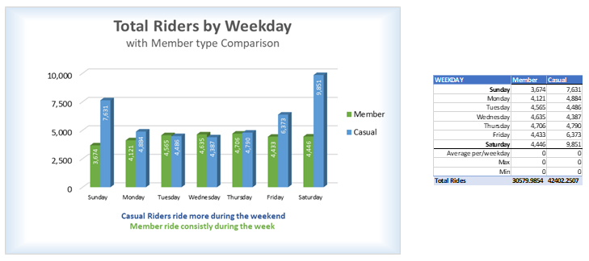

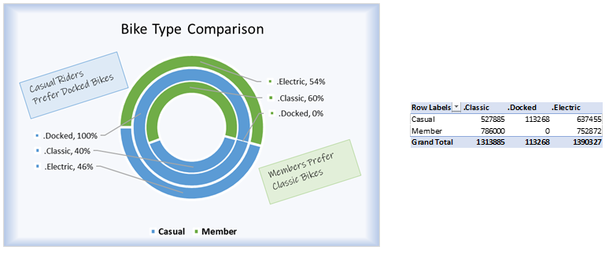

**Utilizing SQL Server management Stutio:**
<pre>
-Created Bikeshare database (manually)
-Create two tables from Import files Bikeshare_22 and Bikeshare_23
-Check the record count in each table for comparison to the original files
-Removed blank column labeled Column1 from tables
-Combine both year tables into Combined_Bikeshare Explore 
-Total number of records in Combined_Bikeshare
-Check for Distinct values in Combined_Bikeshare
-Check for Duplicates
   
  Create and Ran Query for:
  1	Basic Summary Stats - Max, Min, and Mean ride duration 
  2	Summary Stats - Create a table to store summary stats
  3	Preferred Bike Types - Total riders per weekday per rider type
  4	Average ride length per weekday per rider type
  Exploring Interesting Trends:
  5	Top 10 longest rides
  6	Ride count by bike type
</pre>

-	By Membership Type:
  -	Members: Average ride duration is 12.6 minutes.
  -	Casual Riders: Average ride duration is 28.6 minutes.
This information indicates that casual riders tend to take longer trips compared to members.

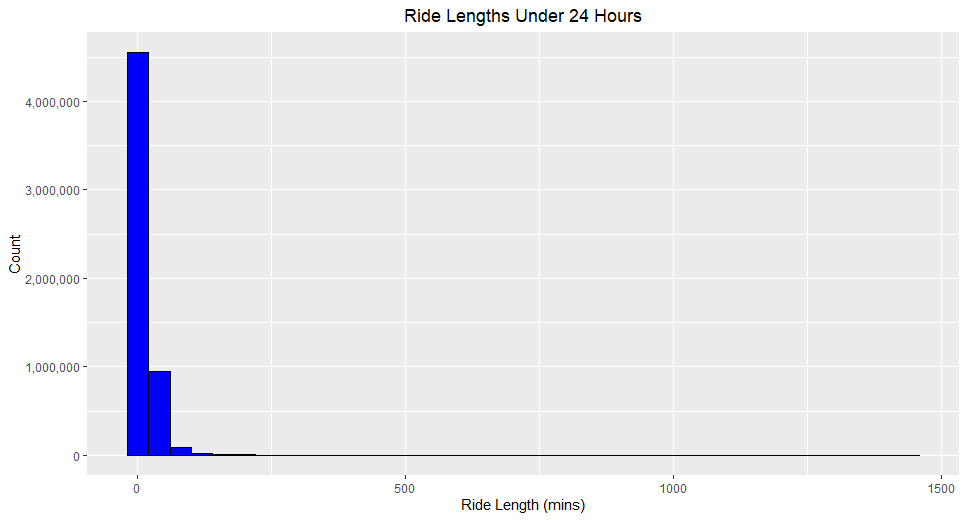

#### Ride Lengths Under 4 Hours (Zoomed-in Bar Chart)

:
#### Breaks down average, median, and standard deviation of ride durations for casual vs. member users.

| Member_Casual | Avg_duration | Med_duration | SD_duration	| Max_duration	| Min_duration|
|---------------|--------------|--------------|-------------|---------------|-------------|
| Casual	      |   20.7	     |      12	    |     41.5	  |     1440	    |        1    |
| Member	      |	  12.2       |       9	    |     19.7	  |     1440	    |        1    |

#### Average Ride Lengths by Rider Type: 
Shows a direct comparison: casual riders consistently take longer rides.
Filter out extreme ride lengths (e.g., over 24 hours = 1440 minutes)

-	Average Ride Length:
    -	Members: Average ride duration is 12.6 minutes.
    -	Casual Riders: Average ride duration is 28.6 minutes.

This information indicates that casual riders tend to take longer trips compared to members.

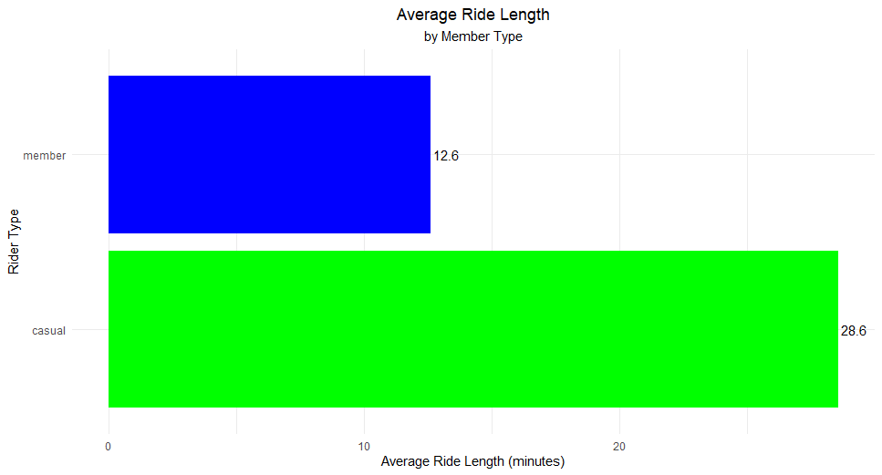

#### Total Ride Lengths by Rider Type: 
Reveals the distribution across ride lengths, comparing casual and member ride patterns.

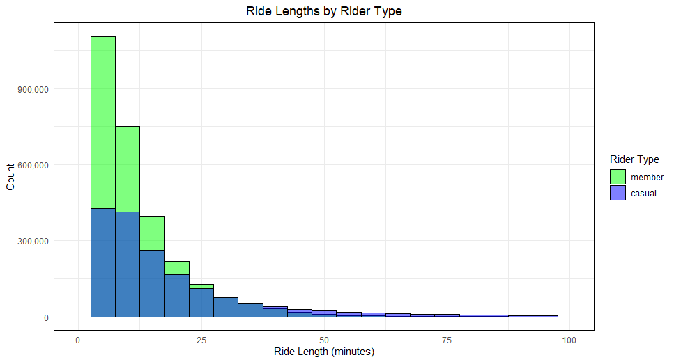

#### Insights:
-	Casual riders take longer individual rides than members, possibly due to leisure use.
-	Members are likely using the bikes more frequently but for shorter, utilitarian trips (e.g., commuting).
-	Casual riders show more activity on weekends, suggesting recreational behavior.

### 3. Temporal Riding Patterns

#### Rides by Weekday and Rider Type:
Highlights usage trends during the week by rider type. Focuses on ride count, not duration.

-	Weekly Trends by Week Day:
    -	Peak Usage: Saturday is the most popular day for rides, especially among casual riders.
    -	Rider Type Usage: Members show consistent usage throughout the week, suggesting routine commuting patterns.

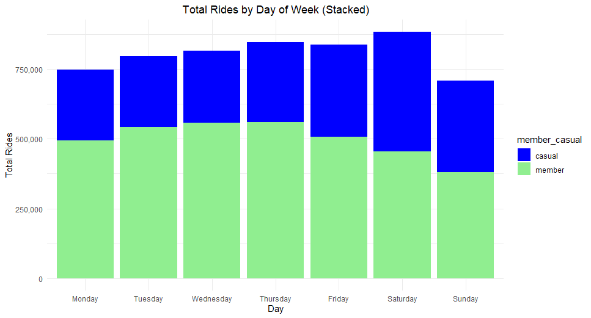

#### Average Ride Length by Member Type and Weekday
-	Casual riders consistently take longer rides than members, especially on weekends.
-	Members’ rides are shorter and more uniform, likely due to commuting or routine trips.

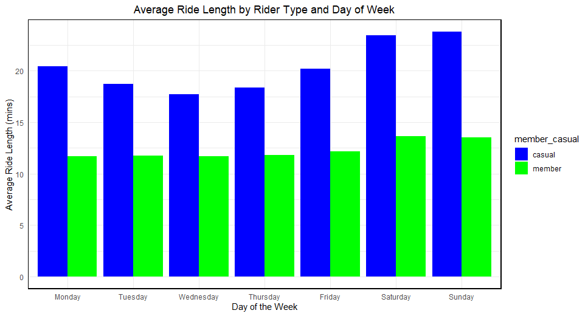

#### Heatmap of Ride Frequency by Hour and Weekday

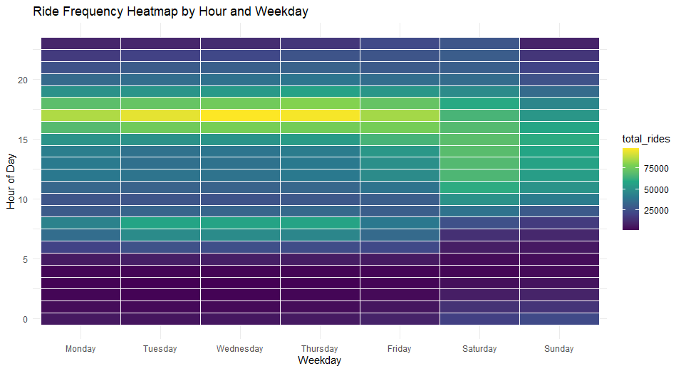

#### Monthly Ride Trends by Rider Type (Line Chart):
Tracks ridership growth/decline over time.

- Monthly Usage Patterns - An analysis of monthly ride data reveals:

    -	Summer Months (June - August): 
        - Members: Consistently high usage, peaking in July with over 429,000 rides.
        - Casual Riders: Steady increase, reaching a peak in August with over 354,000 rides.

    -	Winter Months (December - February):
        - Member: Reduced activity, with the lowest in December at approximately 134,700 rides.
        - Casual Riders: There was a significant drop, with December seeing around 44,200 rides.

-	Winter Months (December - February):
    -	Member: Reduced activity, with the lowest in December at approximately 134,700 rides.
    -	Casual Riders: There was a significant drop, with December seeing around 44,200 rides.
    -	Winter Decline: A noticeable ride drop occurs during winter, particularly among casual riders.
 
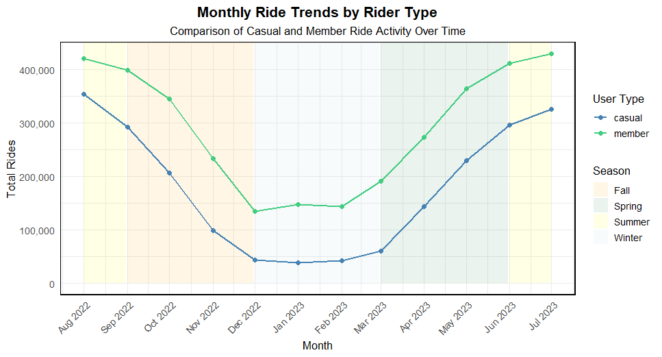

### 4. Special Interest
#### Bike Type Preferences (base on 24-hour rides and under)
-	Members:
    -	Classic Bikes: Preferred choice, averaging 13.1 minutes.
    -	Electric Bikes: Used for shorter trips, averaging 11.4 minutes.
    -	Docked Bikes: Minimal usage.

-	Casual Riders:
    - Classic Bikes: The Average ride duration is 24.7 minutes.
    - Electric Bikes: Average ride duration is 14.9 minutes.
    - Docked Bikes: Significantly longer rides, averaging 51.9 minutes, indicating a preference for leisurely, extended trips.

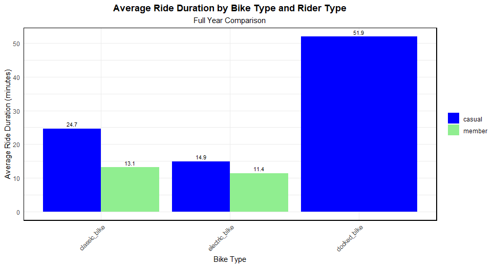

#### Top 15 Stations for long Rides
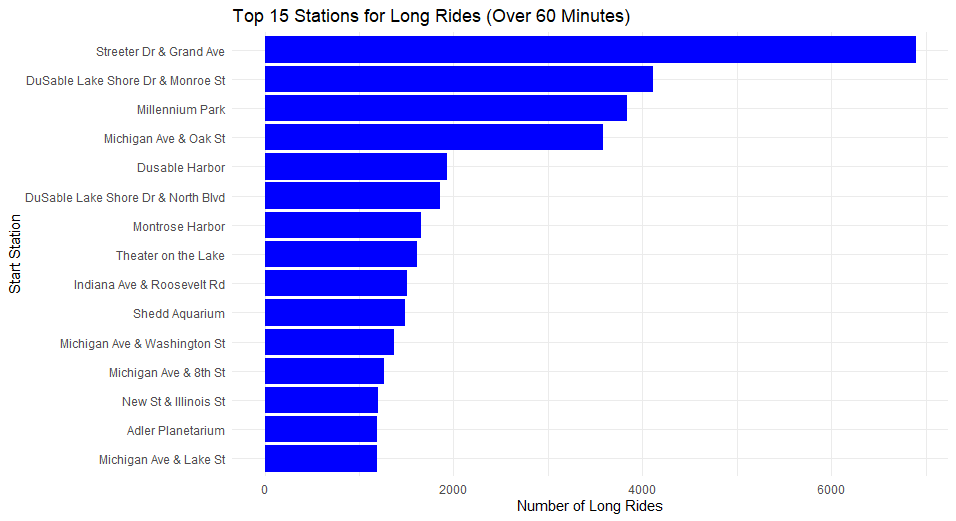
 
 
### Key Takeaways
-	Casual riders prefer longer, leisurely rides, often on weekends and using docked bikes.
- ember exhibit consistent, shorter rides throughout the week, indicating routine usage.
-	Seasonal variations significantly impact casual rider activity, suggesting potential for targeted promotions during off-peak periods.
Strategic Implications

#### To convert casual riders into members:
-	Highlight Cost Savings: Emphasize the financial benefits of membership for frequent, long-duration riders.
-	Flexible Membership Options: Introduce seasonal or weekend passes catering to casual riders' preferences.
-	Targeted Marketing: Deploy campaigns during peak casual usage periods, focusing on the advantages of membership.
By understanding and addressing the distinct behaviors and preferences of rider segments, Cyclistic can enhance user satisfaction and drive membership growth.

